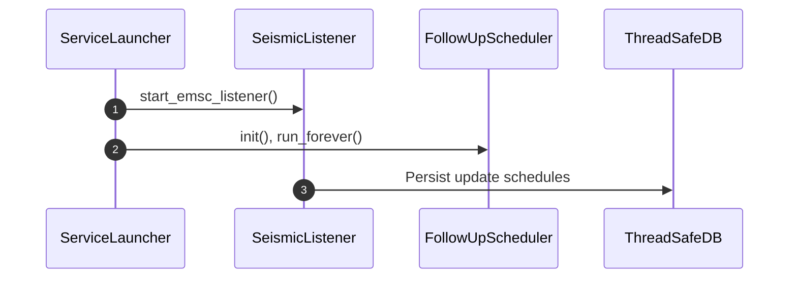
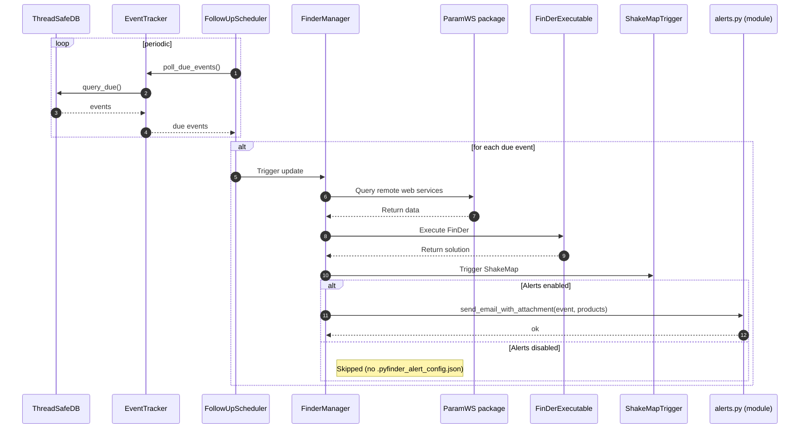

# pyfinder

Python wrapper for the FinDer executable and its library.

## Overview

`pyfinder` provides a convenient Python interface to the FinDer seismic event detection software, allowing for easy integration and automation within Python workflows. It can run **standalone (no Docker required)** or inside the provided **Docker** environment for a fully reproducible setup.

We recommend the [dockerized pyfinder](https://github.com/pyfinder-dev/pyfinder-docker) since it comes with shakemap and FinDer already installed.
---

- [Quick Start](#quick-start)
- [Alerts](#alerts)
- [Collecting Results](#collecting-results)
- [Sequence Diagram](#sequence-diagram)

## Quick Start

### Option A — Standalone (no Docker)

No installation is required for basic use. Note that **pyfinder** requires `ShakeMap` and `FinDer`. You will need to have access to the packages/source codes and install the software. 

1. Open a terminal and navigate to the project folder:
   ```bash
   cd pyfinder/pyfinder
   ```
2. Start monitoring (choose one of the following):
   - Using the helper script:
     ```bash
     ./startMonitoring.sh   # uses python3.9 by default
     ```
   - Or run the Python module directly:
     ```bash
     python start_monitoring.py
     ```


### Option B — In Docker

1. Enter the shared folder and patch ShakeMap **after each container run**:
   
   ```bash
   cd /home/sysop/host_shared
   ./post_start_setup.sh
   ```
2. Start monitoring from inside the container:
   ```bash
   cd /home/sysop/pyfinder/pyfinder
   ```
   ```bash
   ./startMonitoring.sh   # uses python3.9 by default
   ```

   Or,
   ```bash
   python3.9 start_monitoring.py
   ```

> **Note:** The ShakeMap patch step is required each time you do a fresh (re)start the container so the modified modules are in place.

---

## Alerts

Alerts are optional. If configured, pyfinder can send email notifications when events are detected.

1. Copy the template file to enable alerts:
   ```bash
   cp .pyfinder_alert_config_template.json .pyfinder_alert_config.json
   ```
2. Edit `.pyfinder_alert_config.json` with your SMTP settings and recipients:
   ```json
   {
     "address": "alert_service@someserver.com",
     "password": "somepassword",
     "smtp_server": "smtp.someserver.com",
     "smtp_port": 587,

     "to": [
       "recipient@example.com",
       "second_recipient@example.com"
     ],
     "from": "alert_service@someserver.com",
     "subject": "PyFinder event alert"
   }
   ```
3. **Disable alerts** by removing or renaming `.pyfinder_alert_config.json`.

---

## Collecting Results

### In Docker (host mounts)

If you start the container with host volume mounts, ShakeMap and FinDer outputs are available on the host **without entering** the container. A typical `docker run` uses:

```bash
docker run --init \
  -d \
  --name $CONTAINER_NAME \
  --platform linux/amd64 \
  -u sysop \
  -w /home/sysop \
  -v "$(pwd)/host_shared:/home/sysop/host_shared" \
  -v "$HOST_OUT/shakemap:/home/sysop/shakemap_profiles/default/data" \
  -v "$HOST_OUT/PyFinder-output:/home/sysop/pyfinder/pyfinder/output" \
  $CONTAINER_NAME:master \
  bash -lc "tail -f /dev/null"
```

With this mapping:
- ShakeMap data → `$HOST_OUT/shakemap`
- PyFinder results → `$HOST_OUT/PyFinder-output`

### Standalone (no Docker)

By default, outputs are written to the **`pyfinder/pyfinder/output/`** folder under the project root.

---

## Sequence diagram
### Listening event alerts from EMSC



### Execution of update schedule

