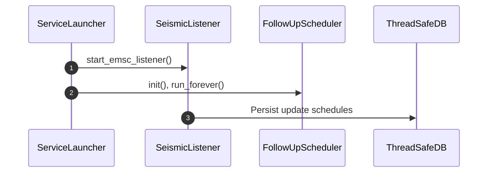
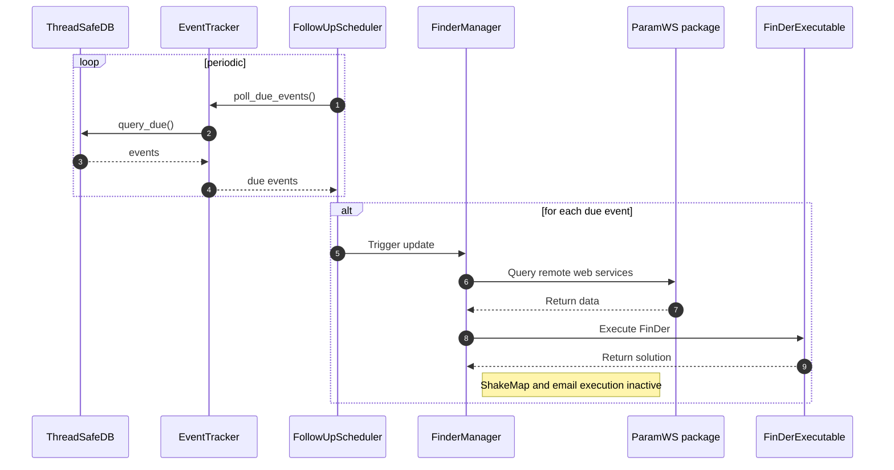

# pyfinder

Python wrapper for the FinDer executable and its library.

## Overview

`pyfinder` provides the internal application workflows around the FinDer
seismic event detection software. FinDer-backed execution belongs inside the
forthcoming PyFinder container.
---

- [Quick Start](#quick-start)
- [Current execution boundaries](#current-execution-boundaries)
- [Sequence Diagram](#sequence-diagram)

## Quick Start

The current internal workflow commands are:

```bash
pyfinder continuous
pyfinder playback --list
pyfinder playback --event-id EVENT_ID
pyfinder on-demand --event-id EVENT_ID
```

Each command expects the configured runtime directories and dependencies to be
available. These are internal application interfaces.

---

## Current execution boundaries

ShakeMap and email execution are currently inactive. Deployment commands and
final host usage will be documented when the PyFinder container image and host
controller exist.

---

## Sequence diagram

The diagrams retain workflow context. Their ShakeMap and email steps are
inactive in the current application.

### Listening event alerts from EMSC


```mermaid
sequenceDiagram
    autonumber
    participant SLA as ServiceLauncher
    participant SLI as SeismicListener
    participant FUS as FollowUpScheduler
    participant DB as ThreadSafeDB

    SLA->>SLI: start_emsc_listener()
    SLA->>FUS: init(), run_forever()

    SLI->>DB: Persist update schedules
```

### Execution of update schedule

```mermaid
sequenceDiagram
    autonumber
    participant DB as ThreadSafeDB
    participant ET as EventTracker
    participant FUS as FollowUpScheduler
    participant FM as FinderManager
    participant P as ParamWS package
    participant FE as FinDerExecutable

    loop periodic 
      FUS->>ET: poll_due_events()
      ET->>DB: query_due()
      DB-->>ET: events
      ET-->>FUS: due events
    end

    alt for each due event
      FUS->>FM: Trigger update
      FM->>P: Query remote web services
      P-->>FM: Return data
      FM->>FE: Execute FinDer
      FE-->>FM: Return solution
      Note right of FM: ShakeMap and email execution inactive
    end

    
```
