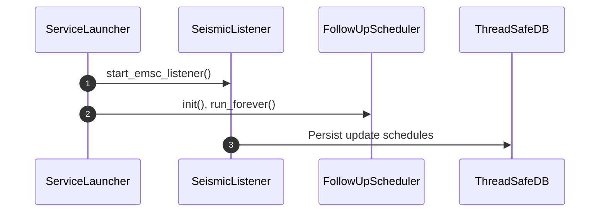
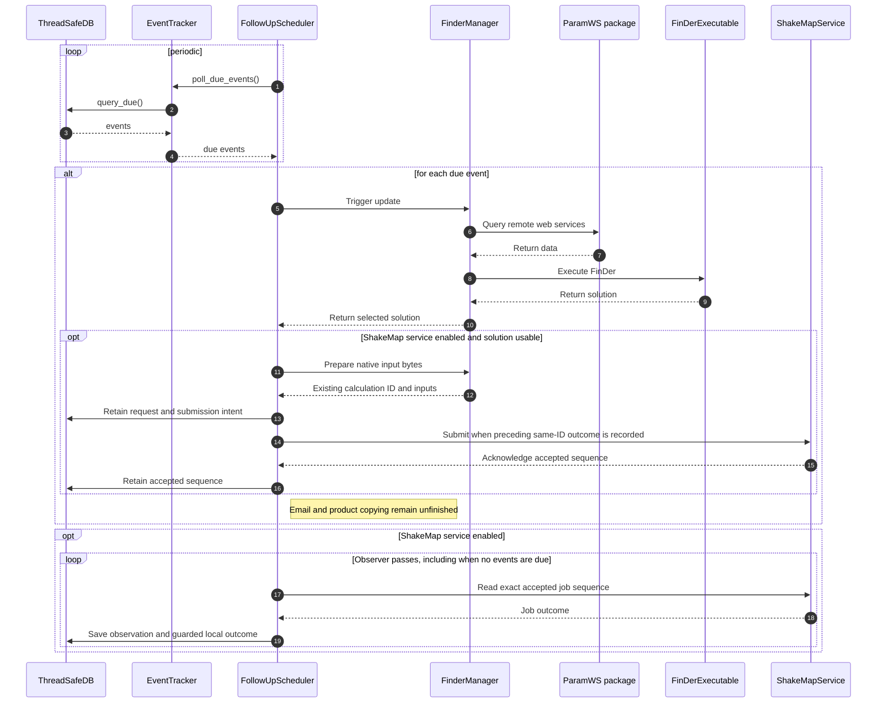

# pyfinder

Python wrapper for the FinDer executable and its library.

## Overview

`pyfinder` provides the internal application workflows around the FinDer
seismic event detection software. FinDer-backed execution belongs inside the
forthcoming PyFinder container.
---

- [Quick Start](#quick-start)
- [Current execution boundaries](#current-execution-boundaries)
- [Sequence Diagram](#sequence-diagram)

## Quick Start

The current internal workflow commands are:

```bash
pyfinder continuous
pyfinder playback --list
pyfinder playback --event-id EVENT_ID
pyfinder on-demand --event-id EVENT_ID
```

Each command expects the configured runtime directories and dependencies to be
available. These are internal application interfaces.

---

## Current execution boundaries

Continuous operation can submit to the separate ShakeMap REST service and
monitor its accepted jobs. This integration is disabled by default; it requires
an explicit endpoint and shared caller-owned input directory. See the
[adapter configuration and limitations](docs/shakemap-adapter.md).

Product collection and email notifications remain unfinished. Playback and
on-demand do not activate this external workflow. Host unit tests do not establish
live service integration or deployment readiness.

---

## Sequence diagram

The diagrams show the current continuous workflow. The external ShakeMap
steps run only when explicitly enabled; notification delivery remains separate.

### Listening event alerts from EMSC


```mermaid
sequenceDiagram
    autonumber
    participant SLA as ServiceLauncher
    participant SLI as SeismicListener
    participant FUS as FollowUpScheduler
    participant DB as ThreadSafeDB

    SLA->>SLI: start_emsc_listener()
    SLA->>FUS: init(), run_forever()

    SLI->>DB: Persist update schedules
```

### Execution of update schedule

```mermaid
sequenceDiagram
    autonumber
    participant DB as ThreadSafeDB
    participant ET as EventTracker
    participant FUS as FollowUpScheduler
    participant FM as FinderManager
    participant P as ParamWS package
    participant FE as FinDerExecutable
    participant SM as ShakeMapService

    loop periodic 
      FUS->>ET: poll_due_events()
      ET->>DB: query_due()
      DB-->>ET: events
      ET-->>FUS: due events
    end

    alt for each due event
      FUS->>FM: Trigger update
      FM->>P: Query remote web services
      P-->>FM: Return data
      FM->>FE: Execute FinDer
      FE-->>FM: Return solution
      FM-->>FUS: Return selected solution
      opt ShakeMap service enabled and solution usable
        FUS->>FM: Prepare native input bytes
        FM-->>FUS: Existing calculation ID and inputs
        FUS->>DB: Retain request and submission intent
        FUS->>SM: Submit when preceding same-ID outcome is recorded
        SM-->>FUS: Acknowledge accepted sequence
        FUS->>DB: Retain accepted sequence
      end
      Note right of FUS: Email and product copying remain unfinished
    end

    opt ShakeMap service enabled
      loop Observer passes, including when no events are due
        FUS->>SM: Read exact accepted job sequence
        SM-->>FUS: Job outcome
        FUS->>DB: Save observation and guarded local outcome
      end
    end
```
