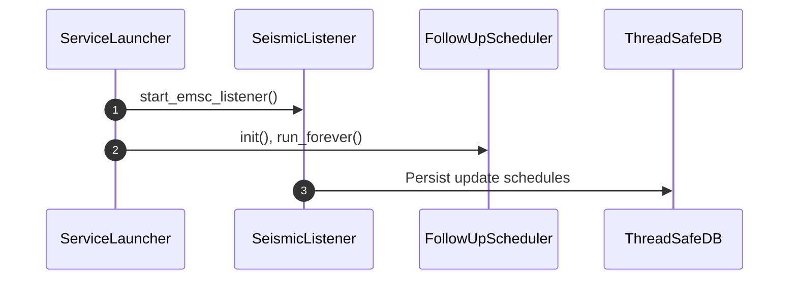

# pyfinder

Python wrapper for the FinDer executable and its library.

## Overview

`pyfinder` provides the internal application workflows around the FinDer
seismic event detection software. FinDer-backed execution belongs inside the
forthcoming PyFinder container.
---

- [Quick Start](#quick-start)
- [Current execution boundaries](#current-execution-boundaries)
- [Sequence Diagram](#sequence-diagram)

## Quick Start

The current internal workflow commands are:

```bash
pyfinder continuous
pyfinder playback --list
pyfinder playback --event-id EVENT_ID
pyfinder on-demand --event-id EVENT_ID
```

Each command expects the configured runtime directories and dependencies to be
available. These are internal application interfaces.

---

## Current execution boundaries

Continuous operation can submit to the separate ShakeMap REST service and
monitor its accepted jobs. This integration is disabled by default; it requires
an explicit endpoint and shared caller-owned input directory, supplied through
the documented `PYFINDER_SHAKEMAP_*` environment variables. See the
[adapter configuration and limitations](docs/shakemap-adapter.md).

Full product collection remains unfinished; terminal email delivery uses the
existing private configuration. Playback and
on-demand do not activate this external workflow. Host unit tests do not establish
live service integration or deployment readiness.

---

## Sequence diagram

The diagrams show the current continuous workflow. The external ShakeMap
steps run only when explicitly enabled; notification delivery remains separate.

### Listening event alerts from EMSC


```mermaid
sequenceDiagram
    autonumber
    participant SLA as ServiceLauncher
    participant SLI as SeismicListener
    participant FUS as FollowUpScheduler
    participant DB as ThreadSafeDB

    SLA->>SLI: start_emsc_listener()
    SLA->>FUS: init(), run_forever()

    SLI->>DB: Persist update schedules
```

### Execution of update schedule
```mermaid
sequenceDiagram
    autonumber
    participant DB as ThreadSafeDB
    participant ET as EventTracker
    participant FUS as FollowUpScheduler
    participant FM as FinderManager
    participant P as ParamWS package
    participant FE as FinDerExecutable
    participant SM as ShakeMapService

    loop periodic 
      FUS->>ET: poll_due_events()
      ET->>DB: query_due()
      DB-->>ET: events
      ET-->>FUS: due events
    end

    alt for each due event
      FUS->>FM: Trigger update
      FM->>P: Query remote web services
      P-->>FM: Return data
      FM->>FE: Execute FinDer
      FE-->>FM: Return solution
      FM-->>FUS: Return selected solution
      opt ShakeMap service enabled and solution usable
        FUS->>FM: Prepare native input bytes
        FM-->>FUS: Existing calculation ID and inputs
        FUS->>DB: Retain request and submission intent
        FUS->>SM: Submit when preceding same-ID outcome is recorded
        SM-->>FUS: Acknowledge accepted sequence
        FUS->>DB: Retain accepted sequence
      end
      Note right of FUS: Terminal email uses retained evidence; full product copying is separate
    end

    opt ShakeMap service enabled
      loop Observer passes, including when no events are due
        FUS->>SM: Read exact accepted job sequence
        SM-->>FUS: Job outcome
        FUS->>DB: Save observation and guarded local outcome
      end
    end
```


### Terminal email alerts

Continuous operation retains the existing private email configuration. The
search order remains `pyfinder/services/.pyfinder_alert_config.json`, then
`pyfinder/.pyfinder_alert_config.json`; those files are excluded from images and
Git. An optional `PYFINDER_ALERT_CONFIG` selects an absolute path to the same
JSON format, for example an operator-owned file under the existing shared
runtime mount. An empty value explicitly disables mail. No configuration means
no delivery. The launcher forwards this variable by name and refuses an explicit
mismatch with an existing container; it does not recreate containers or copy
credentials. Keep the file readable only by the intended runtime account.

Existing `smtp_server`, `smtp_port`, `from`, `to`, `password` and `subject`
continue to work. As before, SMTP authentication uses `from`; the historical
`address` field is accepted but unused. Delivery now respects `smtp_server`.
`security` defaults to `starttls` (or explicitly `tls`); `timeout` defaults to 30
seconds and must be positive and at most 300. Recipients remain hidden from each
other in message headers. Settings are kept outside scientific configuration
and never included in diagnostic logs.

Without `alert_lists`, the existing `to` recipients form one `default` audience
for SUCCESS and FAILED outcomes. To choose separate audiences, add `alert_lists`
to that same private file. Each entry has `name`, `recipients`, `outcomes` and
`required_attachments`; outcomes can include SUCCESS, FAILED, INTERRUPTED and
UNKNOWN. No recipients are provided automatically. An empty required list means
all retained attachments are optional; absent native artifacts are identified in
the report. Require specific filenames such as `data_0`, `service.log`,
`provenance.json`, `product-manifest.json` or `intensity.jpg` when appropriate.
Missing required evidence holds delivery as BLOCKED. Native requirements apply
to the final attempt, not an earlier failed regional run.

Messages identify the public calculation, private attempt, native sequence and
selected configuration through the shared diagnostic projection. When PyFinder
explicitly recovers from a regional configuration failure using global, the
report retains both attempts and reports global as the actual calculation.
Where FinDer input was prepared, the manager also retains its authoritative
earthquake and provider display metadata for the readable email summary.
Observation time is labelled separately from earthquake origin. The selected
FinDer solution summary is separately retained at manager return,
with depth in km and magnitude unchanged. Physical origin comes from authoritative
earthquake metadata, never FinDer's internal timestamp. Missing values remain
explicitly unavailable; no catalogue magnitude type is assigned to FinDer.
FinDer input bytes and available native request/log/provenance/manifest/image
artifacts are captured in caller-owned `state/alert-evidence` before mutable
same-ID paths are reused. This is an email evidence snapshot, not a complete
scientific product archive. No scientific retry is caused by email delivery.

Delivery records live alongside workflow state in the existing SQLite database.
PENDING survives restart; SENT is not replayed. Explicit rejection is FAILED,
partial recipient acceptance is PARTIAL, and an uncertain SMTP completion or
interrupted SENDING record is UNKNOWN. UNKNOWN and PARTIAL are never replayed
automatically; exactly-once SMTP is not promised. A changed audience configuration
blocks already queued mail rather than silently changing its recipients.
SMTP runs outside the scheduler's ShakeMap phase lock.

Inspect the safe delivery state, including missing required artifacts, with:

```sh
python -m pyfinder.services.alert_delivery --database /path/to/workflow.sqlite list
```

A definite FAILED delivery can be explicitly requeued with `retry-failed
<execution-id> <audience>` in place of `list`. This command sends nothing;
the running continuous owner drains the queued item. UNKNOWN/PARTIAL cannot be
requeued through it. The command never reads credentials or prints message
bodies/recipient lists. For host commands use the project-local Python environment.

Implementation tests use fake SMTP, temporary SQLite and temporary files only.
No real email delivery or continuous deployment readiness is established by
those tests. The former sender is retained unchanged under `legacy/alert.py`.
