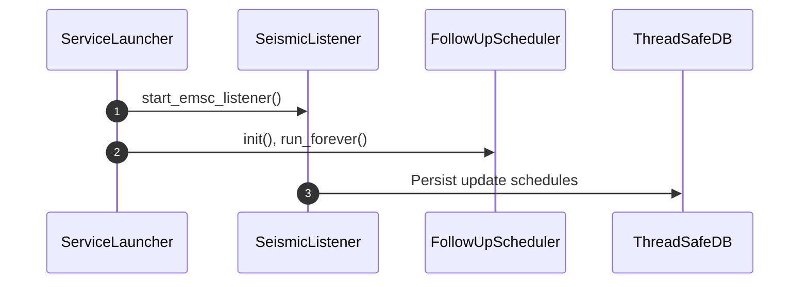

# pyfinder

Python wrapper for the FinDer executable and its library.

## Overview

PyFinder acquires seismic observations, runs FinDer, and can submit its selected
solution to a separate ShakeMap service. Continuous operation schedules event
updates and reports their terminal outcomes by email when configured. Playback
runs selected event IDs through the same calculation and notification services.
FinDer-backed workflows run inside the PyFinder application container.

- [Installation and runtime](#installation-and-runtime)
- [Quick Start](#quick-start)
- [Current execution boundaries](#current-execution-boundaries)
- [Sequence Diagram](#sequence-diagram)
- [Terminal email alerts](#terminal-email-alerts)

## Installation and runtime

Use the [deployment guide](../pyfinder-deploy/README.md) to build the application
image, prepare shared storage and configure the separate ShakeMap service. Keep
`pyfinder` and `pyfinder-deploy` as sibling checkouts. The component host launcher
resolves its own checkout, including symlink invocation, and uses the sibling
`pyfinder-deploy/runtime` directory regardless of the shell's working directory.
It does not build images or choose another runtime from an environment variable.

The application runs as UID/GID `1000:1000`. Its mandatory shared runtime mount
is `/home/sysop/runtime`, with PyFinder state, logs, runs and playbacks under
`/home/sysop/runtime/pyfinder`. These are container paths, not host checkout
locations. The host directories must be writable by that runtime account.

## Quick Start

From the **PyFinder checkout**, inspect the host launcher without starting work:

```bash
scripts/pyfinder --help
scripts/pyfinder status
```

The host launcher manages the canonical `pyfinder-docker` container. Inside the
configured application container, the installed workflow commands are:

```bash
pyfinder continuous
pyfinder playback --list
pyfinder playback --event-ids EVENT_ID
pyfinder playback --event-ids EVENT_ID_1 EVENT_ID_2 --full-schedule --fast
```

These workflow commands require the runtime and dependencies prepared by the
deployment guide. Use the host launcher's corresponding commands to invoke
playback in the existing application container; playback does not start a second
container. It keeps its state separate from the continuous scheduler database.

### Playback

`pyfinder playback` uses the maintained list of event IDs. Supply one or more
IDs with `--event-ids` to select other events; `--list` displays the maintained
list without running calculations. Each attempt queries the configured providers
and uses their priority-selected earthquake context, including for maintained
events. It does not recreate historical observation availability.

By default, each event gets one immediate execution of the full chain:
acquisition, FinDer, ShakeMap, and configured terminal notification handling.
`--full-schedule` adds the configured follow-ups, currently at 5, 15, 60, 180,
360, 1440, and 2880 minutes after registration. `--fast` makes those follow-ups
due two minutes apart, so the complete schedule is due at 0, 2, 4, 6, 8, 10,
12, and 14 minutes for each event. It has no effect on a single-step schedule.

Fast timing applies within each event; different events may be due together.
It controls when work becomes eligible, not when FinDer finishes or the
ShakeMap HTTP request is sent. Existing queueing, retry timing, and same-ID
serialization still apply. Calculation IDs retain their nominal schedule step;
logs distinguish that step from the actual due and execution times.

Playback requires the ShakeMap configuration described below. It reports a
missing prerequisite rather than treating FinDer-only execution as a completed
full chain. Email follows the existing alert configuration. To run a manual
calculation without sending email, explicitly disable alert configuration for
that command, for example from the PyFinder checkout:

```bash
PYFINDER_ALERT_CONFIG='' scripts/pyfinder playback --event-ids EVENT_ID
```

Playback prints the path to its retained database:
`runtime/pyfinder/state/playbacks/<command-trigger-UTC>/scheduled_queries.sqlite3`.
Its captured alert evidence is stored in `alert-evidence/` beside that database.
Use this invocation's database, rather than the continuous database, when
inspecting playback delivery records with the command below.

The command waits for the selected schedules and accepted ShakeMap jobs to settle.
It returns zero for successful calculation chains with successful or deliberately
suppressed email handling. Calculation failures, uncertain submissions, observation
or evidence errors, and failed, blocked, unknown, or partial delivery produce a
nonzero result; Ctrl+C returns 130. State is retained for inspection. A later
playback invocation starts new work and does not resume or automatically replay
previous uncertain submissions or messages. If another invocation still owns the
same public calculation ID, playback reports that conflict before submitting it.
An uncertain or interrupted owner can retain that protection after exit; inspect
the named owner database rather than deleting the marker to force replacement.

The public `on-demand`, singular `--event-id`, and `--test` options are removed.
Use `playback --event-ids` for a specific event. `--verbosity` controls application
logging; it does not change calculation behavior.

---

## Current execution boundaries

Continuous operation and playback use the same ShakeMap REST adapter to submit
and monitor jobs. Continuous operation leaves it disabled by default; playback
requires it for the full chain. Enabling the adapter requires
an explicit endpoint and shared caller-owned input directory, supplied through
the documented `PYFINDER_SHAKEMAP_*` environment variables. See the
[adapter configuration and limitations](docs/shakemap-adapter.md).

General product distribution is not provided by the adapter. Terminal email
uses retained input and diagnostic evidence, configured separately below.
Enabling the adapter does not validate regional data, establish network access
or confirm delivery to an SMTP server.

---

## Sequence diagram

The diagrams show the current continuous workflow. The external ShakeMap
steps run only when explicitly enabled; notification delivery remains separate.

### Listening event alerts from EMSC


```mermaid
sequenceDiagram
    autonumber
    participant SLA as ServiceLauncher
    participant SLI as SeismicListener
    participant FUS as FollowUpScheduler
    participant DB as ThreadSafeDB

    SLA->>SLI: start_emsc_listener()
    SLA->>FUS: init(), run_forever()

    SLI->>DB: Persist update schedules
```

### Execution of update schedule
```mermaid
sequenceDiagram
    autonumber
    participant DB as ThreadSafeDB
    participant ET as EventTracker
    participant FUS as FollowUpScheduler
    participant FM as FinderManager
    participant P as ParamWS package
    participant FE as FinDerExecutable
    participant SM as ShakeMapService

    loop periodic 
      FUS->>ET: poll_due_events()
      ET->>DB: query_due()
      DB-->>ET: events
      ET-->>FUS: due events
    end

    alt for each due event
      FUS->>FM: Trigger update
      FM->>P: Query remote web services
      P-->>FM: Return data
      FM->>FE: Execute FinDer
      FE-->>FM: Return solution
      FM-->>FUS: Return selected solution
      opt ShakeMap service enabled and solution usable
        FUS->>FM: Prepare native input bytes
        FM-->>FUS: Existing calculation ID and inputs
        FUS->>DB: Retain request and submission intent
        FUS->>SM: Submit when preceding same-ID outcome is recorded
        SM-->>FUS: Acknowledge accepted sequence
        FUS->>DB: Retain accepted sequence
      end
      Note right of FUS: Terminal email uses retained evidence; full product copying is separate
    end

    opt ShakeMap service enabled
      loop Observer passes, including when no events are due
        FUS->>SM: Read exact accepted job sequence
        SM-->>FUS: Job outcome
        FUS->>DB: Save observation and guarded local outcome
      end
    end
```


## Terminal email alerts

Continuous operation reads the private email configuration. The search order is `pyfinder/services/.pyfinder_alert_config.json`, then
`pyfinder/.pyfinder_alert_config.json`; those files are excluded from images and
Git. The [configuration template](pyfinder/.pyfinder_alert_config_template.json)
shows the supported existing fields; provide your own account and recipients.
An optional `PYFINDER_ALERT_CONFIG` selects an absolute path to the same
JSON format, for example an operator-owned file under the existing shared
runtime mount. An empty value explicitly disables mail. No configuration means
no delivery. The launcher forwards this variable by name and refuses an explicit
mismatch with an existing container; it does not recreate containers or copy
credentials. Keep the file readable only by the intended runtime account.

The configuration uses `smtp_server`, `smtp_port`, `from`, `to`, `password` and
`subject`. SMTP authentication uses `from`; the historical `address` field is
accepted but unused. Delivery connects to `smtp_server`.
`security` defaults to `starttls` (or explicitly `tls`); `timeout` defaults to 30
seconds and must be positive and at most 300. Recipients remain hidden from each
other in message headers. Settings are kept outside scientific configuration
and never included in diagnostic logs.

Without `alert_lists`, the existing `to` recipients form one `default` audience
for SUCCESS and FAILED outcomes. To choose separate audiences, add `alert_lists`
to that same private file. Each entry has `name`, `recipients`, `outcomes` and
`required_attachments`; outcomes can include SUCCESS, FAILED, INTERRUPTED and
UNKNOWN. No recipients are provided automatically. An empty required list means
all retained attachments are optional; absent native artifacts are identified in
the report. Require specific filenames such as `data_0`, `service.log`,
`provenance.json`, `product-manifest.json` or `intensity.jpg` when appropriate.
Missing required evidence holds delivery as BLOCKED. Native requirements apply
to the final attempt, not an earlier failed regional run.

Messages identify the public calculation, private attempt, native sequence and
selected configuration. Service selection and materialization are reported
separately from evidence that native execution occurred. When PyFinder requests
global after a confirmed regional configuration failure, the report retains
both attempts, the fallback reason and the final outcome.
Where FinDer input was prepared, the manager also retains its authoritative
earthquake and provider display metadata for the readable email summary.
Observation time is labelled separately from earthquake origin. The selected
FinDer solution summary is separately retained at manager return,
with depth in km and magnitude unchanged. Physical origin comes from authoritative
earthquake metadata, never FinDer's internal timestamp. Missing values remain
explicitly unavailable; no catalogue magnitude type is assigned to FinDer.
FinDer input bytes and available native request/log/provenance/manifest/image
artifacts are captured in caller-owned `state/alert-evidence` before mutable
same-ID paths are reused. This is an email evidence snapshot, not a complete
scientific product archive. No scientific retry is caused by email delivery.

Delivery records live alongside workflow state in the existing SQLite database.
PENDING survives restart; SENT is not replayed. Explicit rejection is FAILED,
partial recipient acceptance is PARTIAL, and an uncertain SMTP completion or
interrupted SENDING record is UNKNOWN. UNKNOWN and PARTIAL are never replayed
automatically; exactly-once SMTP is not promised. A changed audience configuration
blocks already queued mail rather than silently changing its recipients.
SMTP runs outside the scheduler's ShakeMap phase lock.

Inside the application container, inspect delivery state and missing required
artifacts without sending mail:

```sh
python3.12 -m pyfinder.services.alert_delivery \
  --database /home/sysop/runtime/pyfinder/state/scheduled_queries.sqlite3 list
```

A definite FAILED delivery can be explicitly requeued with `retry-failed
<execution-id> <audience>` in place of `list`. This command sends nothing;
the running continuous owner drains the queued item. UNKNOWN/PARTIAL cannot be
requeued through it. The command never reads credentials or prints message
bodies or recipient lists. If running the inspection command on the host,
activate the project's Python environment and supply the corresponding absolute
host database path. Do not point experimental tests at this operational database.

Missing configuration suppresses delivery. Invalid configuration stops workflow
startup; connection or authentication failure records a delivery failure without
repeating scientific work. Validate the intended server and recipients before
enabling operational mail. See [verification](docs/shakemap-adapter.md#verification)
for the distinction between offline tests and deployed checks.

The former sender is retained as historical reference in
[legacy/alert.py](legacy/alert.py); it is not an active fallback.
